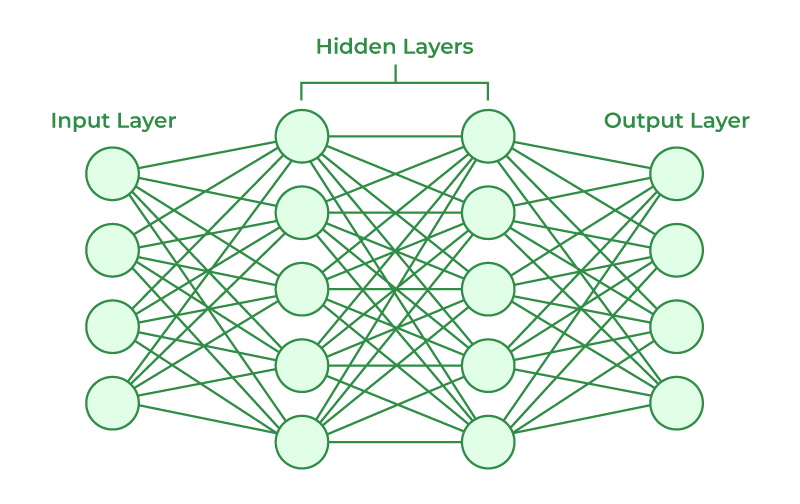
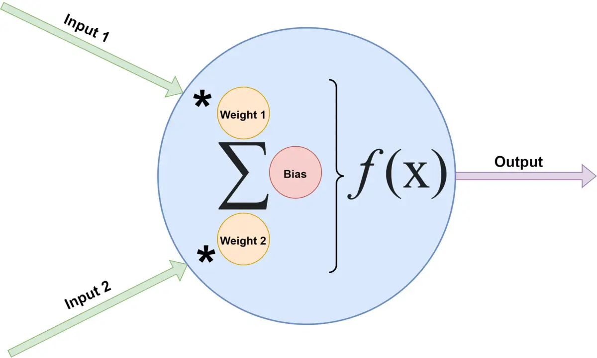

# Neural Network

## Architecture
Artificial neural network (ANN) consists of 3 parts.

    
    

1. **Input layer**: It forms the first layer of the network. It is responsible for receiving the initial data or input. Each node in the input layer represents a feature from the dataset being fed into the network.
2. **Output layer**: It is the final layer of the network. Its purpose is to make the prediction. The neurons represents the target variables or classes that the network tries to predict.
3. **Hidden layers**: They are located between the input layer and output layer. They process the inputs received from previous layer and pass the processed information the next layer. Each hidden layer also consists of neurons representing values are not observed in the training set. The neurons between hidden layers are connected to each other. The above graph on the left shows all connections of a network.

## Notations
Denote
* $l$: number of layers. Its value ranges from $1$ to $L$. The first layer refers to the first hidden layer. The last layer or Layer $L$ refers to the output layer
* $n^{[0]}$ or $n_{x}$: number of features
* $n^{[l]}$: number of neurons in Layer $l$
* $x = \begin{bmatrix} x_{1} \\ x_{2} \\ \vdots \\ x_{n_{x}} \end{bmatrix} = a^{[0]} \in \mathbb{R}^{(n_{x},1)}$: features or activation values at input layer for 1 sample

The calculation of the activation values at Layer $l$ and the output layer are as follows.
* $a^{[l]} \in \mathbb{R}^{(n^{[l]},1)}$: activation values at Layer $l$
* $\hat{y} \in \mathbb{R}^{(n^{[L]},1)})$: predicted values i.e. the activation values at the output layer
* $W^{[l]} \in \mathbb{R}^{(n^{[l]}, n^{[l-1]})}$ : weight matrix for Layer $l$
* $b^{[l]} \in \mathbb{R}^{(n^{[l]},1)}$: bias for Layer $l$
* $g^{[l]}$: activation function for Layer $l$

$$\begin{align*} z^{[l]} &= W^{[l]} a^{[l-1]}+b^{[l]} \in \mathbb{R}^{(n^{[l]},1)} 
\\ 
\begin{bmatrix} z_{1}^{[l]} \\ z_{2}^{[l]} \\ \vdots \\ z_{n^{[l]}}^{[l]} \end{bmatrix} &= \begin{bmatrix}  {w_{1}^{[l]}}^{T}  \\  {w_{2}^{[l]}}^{T}  \\  \vdots  \\  {w_{n^{[l]}}^{[l]}}^{T}  \end{bmatrix} \begin{bmatrix} a_{1}^{[l-1]} \\ a_{2}^{[l-1]} \\ \vdots \\ a_{n^{[l-1]}}^{[l-1]} \end{bmatrix} + \begin{bmatrix} b_{1}^{[l]} \\ b_{2}^{[l]} \\ \vdots \\ b_{n^{[l]}}^{[l]} \end{bmatrix}

= \begin{bmatrix} {w_{1}^{[l]}}^{T} a^{[l-1]} + b_{1}^{[1]} \\ {w_{2}^{[l]}}^{T} a^{[l-1]} + b_{2}^{[1]} \\ 
\vdots \\ 
{w_{n^{[l]}}^{[l]}}^{T} a^{[l-1]} + b_{n^{[l]}}^{[1]}
\end{bmatrix} \\ \\

a^{[l]} &= g^{[l]}(z^{[l]}) \in \mathbb{R}^{(n^{[l]},1)} \\ 
\begin{bmatrix} a^{[l]}_{1} \\ a^{[l]}_{2} \\ \vdots \\ a^{[l]}_{n^{[l]}} \end{bmatrix} &= \begin{bmatrix} g^{[l]}(z_{1}^{[l]}) \\ g^{[l]}(z_{2}^{[l]}) \\ \vdots \\ g^{[l]}(z_{n^{[l]}}^{[l]}) \end{bmatrix}
\\ \\ 
\hat{y} &= a^{[L]}
\end{align*}$$

In practice, the calculation is performed in parallel for all samples in the batch. It is common to use the following notations. Let's say we have a batch of $m$ samples.
$$\begin{align*}
X &= \begin{bmatrix} | & | & & | \\ x^{(1)} & x^{(2)} & ... & x^{(m)} \\ | & | & & | \\ \end{bmatrix} \in \mathbb{R}^{(n_{x},m)} \\ &= A^{[0]}
\\ \\
Z^{[l]} &= \begin{bmatrix} | & | & & | \\ z^{[l](1)} & z^{[l](2)} & ... & z^{[l](m)} \\ | & | & & | \\ \end{bmatrix} \in \mathbb{R}^{(n^{[l]},m)} \\ &=  W^{[l]}A^{[l-1]} + b^{[l]} 
\\ \\
A^{[l]} &=  \begin{bmatrix} | & | & & | \\ a^{[l](1)} & a^{[l](2)} & ... & a^{[l](m)} \\ | & | & & | \\ \end{bmatrix} \in \mathbb{R}^{(n^{[l]},m)} \\&= g^{[l]}(Z^{[l]}) 
\end{align*}$$
* $b^{[l]} \in \mathbb{R}^{(n^{[l]},1)}$ will be broadcasted in numpy.

## Training
To train an ANN, the following 2 processes were performed.

**Forward propagation**: The data from the input layer passes through the hidden layers and then reach the output layer. In each neuron, a weighted sum of the input would be calculated. The sum with the addition of the bias is then passed to an activation function. The weights and bias are the parameters of the network. Mathematical formula are shown above. In TensorFlow, by default, weights are initialized using the Xavier initializer, while biases are initialized to a vector of zeros. For the next process, the loss is also calculated by comparing the actual and predicted value.

**Backpropagation**: In contrast, backpropagation starts from the output layer to the first hidden layer. It calculates the gradient of the loss function with respect to the parameter of weights and bias by using the chain rule. The gradient will then be used to update the parameters. To perform the optimisation, it is common to choose batch gradient descent or Adam algorithm.
The above 2 processes were repeated until the parameters are convergent